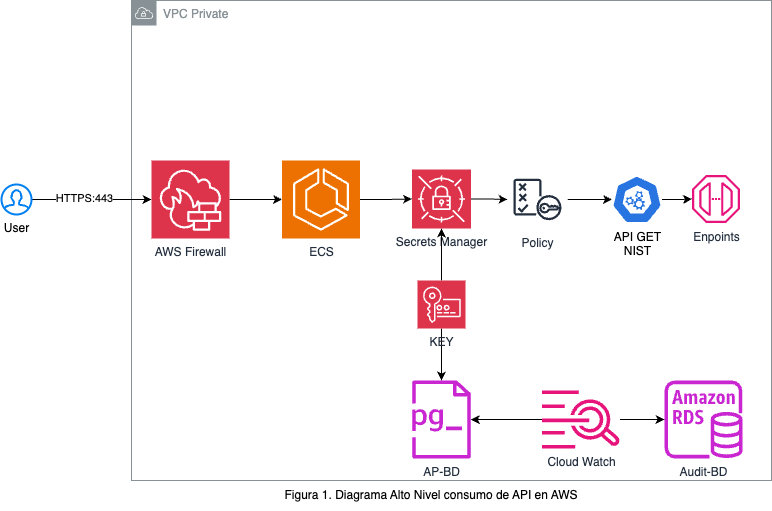

# Cloud Security API

## Descripción
API para gestión de vulnerabilidades detectadas en sistemas Cloud, cruzando información con NIST y permitiendo marcar las vulnerabilidades remediadas por equipo.

## Arquitectura y Seguridad
- **Backend**: FastAPI en Python, desplegable en Docker y AWS ECS.
- **DB**: SQLite para demo, PostgreSQL recomendado en producción.
- **Seguridad**: IAM roles, VPC privada, Secrets Manager (en AWS).
- **Autenticación**: API Key/JWT obligatorio en endpoints de escritura.
- **Logs**: Integración con CloudWatch y DB para auditoría.



## Endpoints Propuestos

| Método | Ruta                                      | Objetivo                                                                 |
|--------|-------------------------------------------|-------------------------------------------------------------------------|
| GET    | /vulnerabilities/summary                  | Listado sumarizado por severidad desde NIST                             |
| POST   | /teams/{team_id}/remediated               | Agregar vulnerabilidades corregidas/remediadas para equipo              |
| GET    | /vulnerabilities/summary?exclude_remediated=true&team_id={team_id} | Listado sumarizado excluyendo corregidas por equipo                     |
| GET    | /vulnerabilities/{cve_id}                 | Detalle de vulnerabilidad                                               |
| GET    | /audit/logs                               | Logs y auditoría de uso de la API (solo admins)                         |

## Autenticación y Autorización
- Se utilizan API Keys (almacenadas y gestionadas en Secrets Manager en AWS).
- Roles de usuario por equipo y nivel de acceso.

## Logs y Trazabilidad
- Logging estructurado con middleware, logs en CloudWatch y DB.
- Auditoría de acciones en DB (quién, qué, cuándo).

## Ejecución Local
```bash
docker build -t cloudsec-api .
docker run -p 8000:8000 cloudsec-api
```

## Pruebas
Incluye scripts en `tests/` para validar endpoints y flujos principales.

## Despliegue AWS
- Crear RDS PostgreSQL.
- Secrets en Secrets Manager.
- ECS/Fargate con VPC privada y SG restrictivo.
- Logs en CloudWatch.

## Consideraciones de Seguridad
- Validación estricta de inputs.
- HTTPS obligatorio.
- Rate limiting.
- Auditoría de acceso y modificaciones.

## Contacto
Carlos Ponce de León Ortega